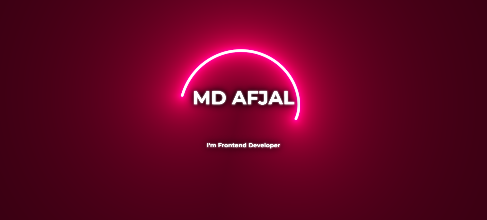

# **Neon Cursor**
This Project is a **Glowing Neon-themed Intro Page** Showcasing my Name and Profession with an Animated Design.  
It features a **Neon Glow Effect**, Modern Fonts and a Stylish Cursor Animation to make the Portfolio Visually Attractive.  

  
## ✨ Features
- **Neon Glowing text animation (Name + Title)
- **Custom Glowing Cursor Effect
- **Gradient background with Futuristic Design
- **Fully Responsive Layout
- **Clean HTML, CSS and JavaScript Structure

## 🛠 Tech Stack

- **HTML5** – Structure and Layout.
- **CSS3** – Styling, Responsiveness and Themes.
- **JavaScript (ES6)** – Interactive Glowing Cursor.
- **Google Fonts** – Clean and Modern typography.

## 📸Screenshots

Below is a Preview of **Neon Cursor**, Showcasing the Layout and Styling implemented Using pure HTML , CSS and Javascript. 
The Design focuses on Clean Structure, Responsiveness and Modern Styling.

